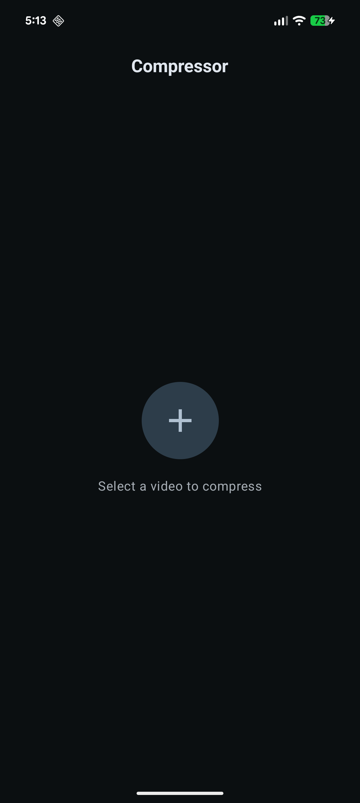
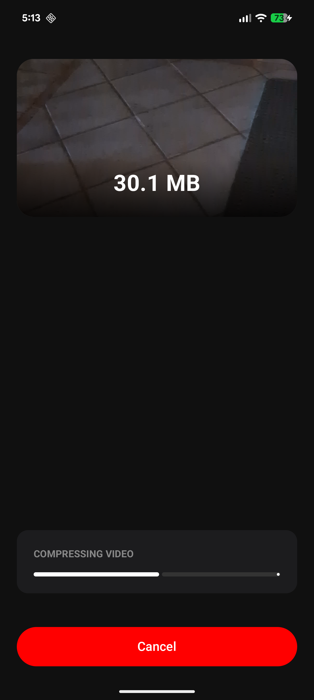
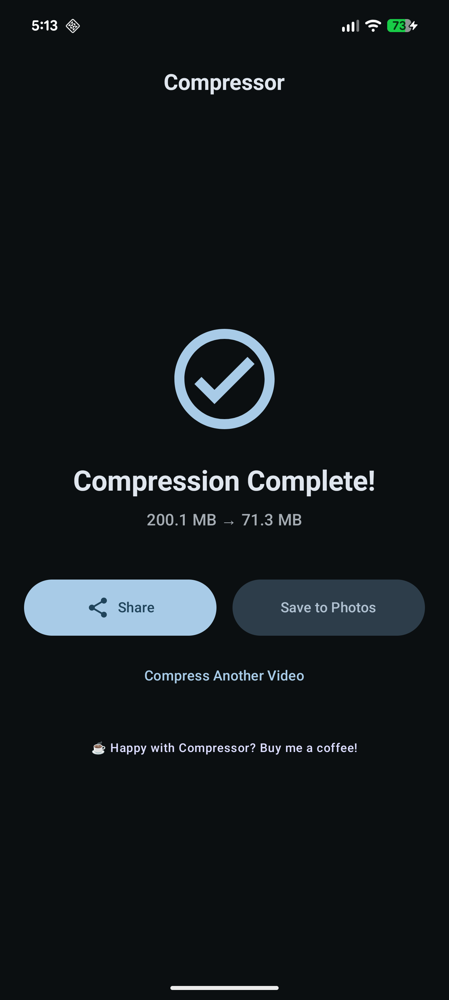

# Compressor
Lightning fast, ad free, super lightweight native video compressor for Android (inspired by the AMAZING Kompresso app for iOS).

      

Do you like Compressor? Consider supporting development by [buying me a coffee](https://www.buymeacoffee.com/joshatticus) ☕️

## Features
- Faster than every single compression app on the Play Store. Period.
- Uses native Media3 library, not another slow, bulky FFMpeg wrapper
- Share Sheet Support
- No third party libraries
- No invasive permissions (no storage, no internet etc)
- Ad free
- Super lightweight (< 10MB)
- Completely native Kotlin (no React Native slop here)
- Simple, clean UI
- Works on Android 7.0 and up
- Reproducible Builds

## Performance
How does Compressor run on different devices? All tests are completed with a 25 second, 200MB 4K video compressed using the Medium preset in Compressor.

| Device                      | Speed    |
|-----------------------------|----------|
| Google Pixel 8 Pro          | 11s 61ms |
| Samsung Galaxy S25          | 7s 99ms
| Samsung Galaxy S10 (Exynos) | 11s 27ms |
| Samsung Galaxy S8+ (Exynos) | 20s 79ms |
| Samsung Galaxy S7 (Exynos)  | 25s 35ms |

And what about Compressor vs Panda Video Compressor, a highly rated video compression app filled with ads with 10M+ downloads. These tests were done using each app on their respective medium presets.

| Device             | Compressor | Panda Video Compressor |
|--------------------|------------|------------------------|
| Google Pixel 8 Pro | 11s 61ms   |  21m 40s 49ms          |

I ran out of time waiting for my 21 minute video compression so I only ran it on my main phone, my Pixel 8 Pro. Hopefully this gives you an idea of how much faster Compressor is compared to an outdated ffmpeg wrapper using software encoding. To be precise, it's 117x faster.

## Credits
Compressor wouldn't be possible without these amazing people

[@BusyBird15](https://github.com/BusyBird15) - Provided funding to get Compressor on Google Play

[@sirtoaks](https://github.com/sirtoaks) - Provided funding to get Compressor on Google Play

I would like to acknowledge that Compressor has used AI language models to assist in translation. Should you find any issues in translation, please open a bug report or a pull request so they can be fixed.

## Star History

