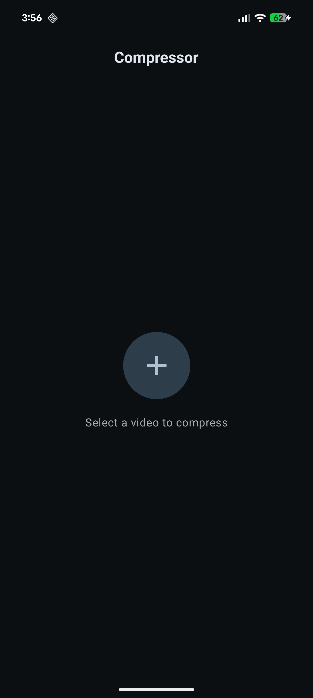
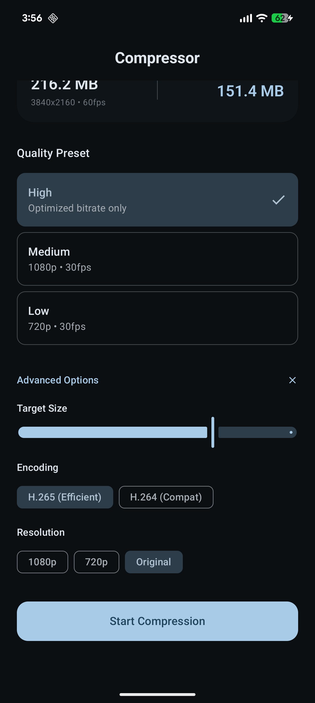
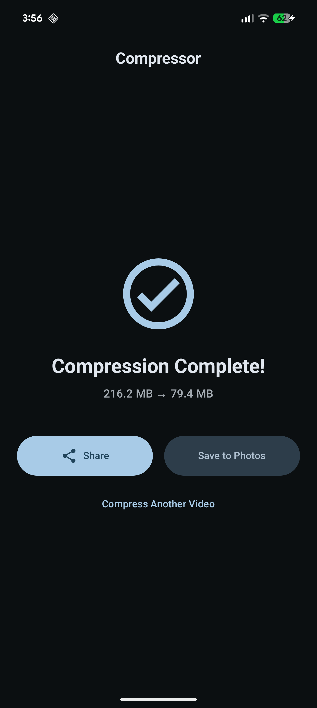

# Compressor
Ad free, completely native, super lightweight video compressor for Android (inspired by the AMAZING Kompresso app for iOS).

Do you like Compressor? Consider supporting development by [buying me a coffee](https://www.buymeacoffee.com/joshatticus) ☕️

## Features
- Faster than every single compression app on the Play Store. Period.
- Uses native Media3 library, not another slow, bulky FFMpeg wrapper
- No third party libraries
- No invasive permissions (no storage, no internet etc)
- Ad free
- Super lightweight (< 10MB)
- Completely native Kotlin (no React Native slop here)
- Simple, clean UI